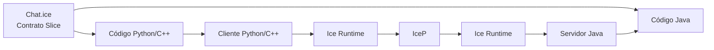
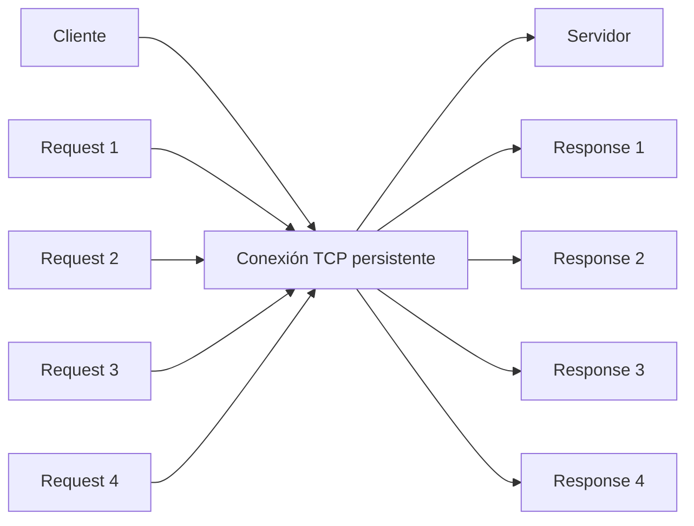
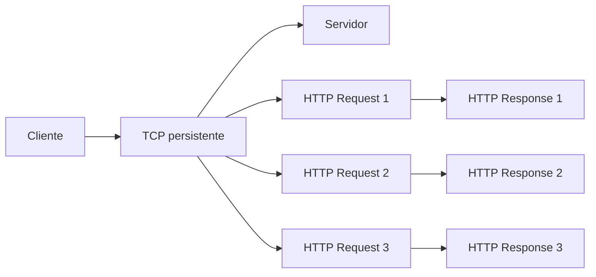
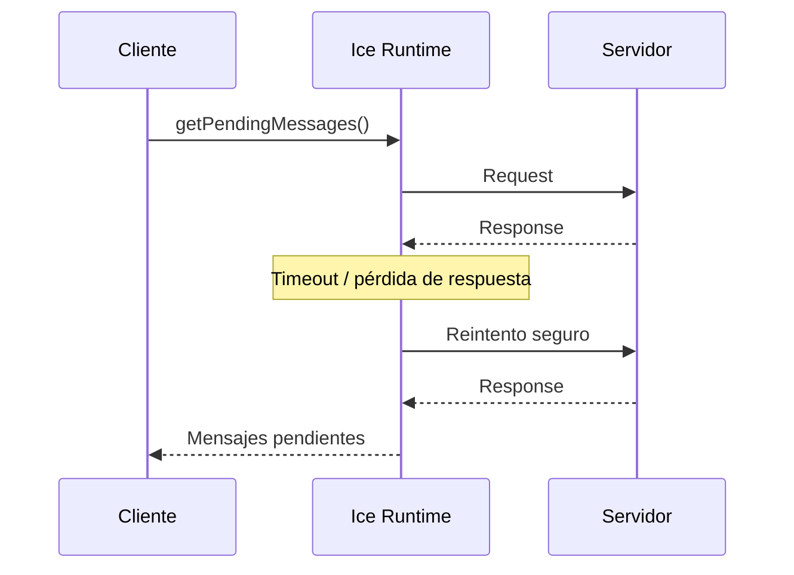
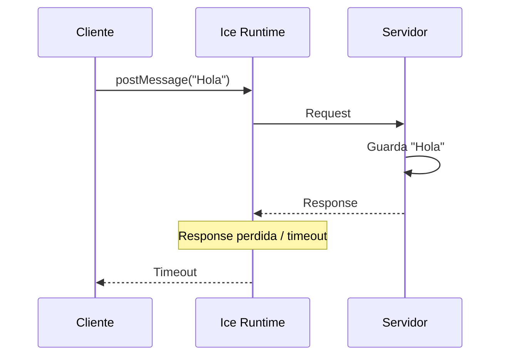
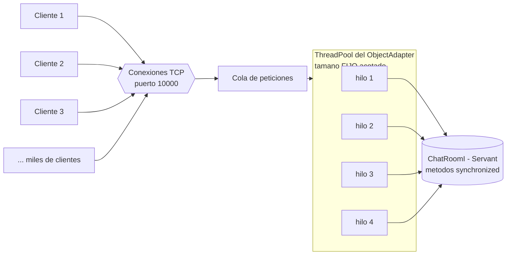

Juan Diego Dominguez A00411836
Andrés Felipe Garcia A00410510

## informe técnico de funcionamiento

Aclaración importante del estado del proyecto: es un proyecto Gradle multimódulo con tres subproyectos (`common`, `server`, `client`). Para compilarlo tenemos que ubicarnos en la raíz del proyecto, que en este caso es `ice-chat-project`, y digitar el siguiente comando: `.\gradlew build`

Vale aclarar que usamos el wrapper (`.\gradlew`) y no `gradle` directo, porque así garantizamos que ambos integrantes usemos la misma versión de Gradle sin depender de lo que cada uno tenga instalado. En este build es donde se dispara automáticamente la tarea `compileSlice`, que invoca a `slice2java` para generar el código Java a partir del contrato `Chat.ice`.

muestra de que pasa la compilación:

![[compilaciongradlewBuild.png]]

## Funcionamiento Código

Primero vamos a poner a correr el server en una terminal para luego levantar los clientes. Nos ubicamos en la raíz del proyecto (aclaración importante para que funcione bien) y ejecutamos el server con el siguiente comando; le pasamos además el parámetro del ThreadPool para que la concurrencia sea real:

`.\gradlew :server:run --console=plain --args="--Ice.ThreadPool.Server.Size=4"`

![[ejecucionServerEsperandoUsers.png]]

ahí el server está corriendo completamente bien; inicializó el `Communicator`, creó el `ObjectAdapter` en el puerto **10000** con la identidad `ChatService` y está escuchando/esperando peticiones de los clientes. Ahora, en una segunda terminal, levantamos el primer cliente con `.\gradlew :client:run --console=plain` e ingresamos el nickname `Alice`:

![[terminalAliceponeNickYMensajes.jpeg]]

Alice quedó autenticada correctamente y le aparecen los comandos disponibles (`/users`, `/exit`) y el prompt `>`. Además, cuando entra el segundo cliente, en su terminal aparece la notificación del sistema en tiempo real `<SISTEMA>: Bob se unio a la sala`, lo que demuestra que el hilo demonio receptor del cliente (el que sondea mensajes cada 500 ms) está funcionando y las notificaciones viajan entre clientes sin bloquear la entrada.

Ahora, en una tercera terminal, levantamos el segundo cliente e ingresamos el nickname `Bob`:

![[terminalBobNickYmensajes.jpeg]]

### Prueba 1 — Intercambio bidireccional

Ahora vamos a probar el intercambio de mensajes. Bob escribe un mensaje desde su terminal:

![[BobEnviaMensajeaAlice.jpeg]]

y miremos si le aparece a Alice en tiempo real con remitente y marca de tiempo:

![[AliceRecibeMensaje.jpeg]]

si se le actualizó; el mensaje de Bob llegó a la terminal de Alice con la hora y el remitente, confirmando la comunicación bidireccional.

### Prueba 2 — Consulta de usuarios (/users)

Ahora ejecutamos el comando `/users` para verificar que lista a todos los usuarios activos:

![[VistaTerminalServerUsers.jpeg]]

en efecto, lista tanto a `Alice` como a `Bob`, confirmando que el server lleva bien el registro de usuarios conectados en su estructura concurrente.

### Prueba 3 — Colisión de nombres

Ahora abrimos una cuarta terminal, levantamos otro cliente e intentamos iniciar sesión con el nombre `Alice`, que ya está conectada, para ver cómo el server rechaza el duplicado:

![[TerminalNuevaIntentaNickDeAlice.jpeg]]

el server responde con la `ChatException`: `[RECHAZADO POR SERVIDOR] El nickname 'Alice' ya se encuentra conectado`, y lo importante es que el cliente **no se cae**: nos deja volver a intentar con otro nickname. Esto valida la validación de negocio del `login` (marcado como `synchronized` en el server).

### Prueba 4 — Desconexión limpia (/exit)

Ahora en la terminal de Bob escribimos `/exit` para cerrar sesión de forma limpia:

![[BobSeVaDeLaCnversacion.jpeg]]

y verificamos que Alice reciba la notificación de la salida, y que al volver a hacer `/users` ya solo aparezca ella:

![[TerminalAliceAnuncioSalidaYusers.jpeg]]

a Alice le llegó `<SISTEMA>: Bob ha abandonado la sala`, y el `/users` ahora solo muestra a Alice. Esto confirma que el `logout` limpió correctamente el estado compartido del server.

### Prueba 5 — Tolerancia a fallos

Por último, la prueba de resiliencia. Vamos a la terminal del server y lo cerramos abruptamente con `Ctrl+C`:

![[ServerSeCierraControl+c.png]]

el server se cerró. Ahora, desde la terminal de Alice, intentamos mandar un mensaje y miramos cómo reacciona el cliente ante la caída del servidor:

![[AlicePierdeConexion.jpeg]]

el cliente reaccionó en dos capas sin colapsar:

1. El **hilo receptor** (el del sondeo cada 500 ms) detectó la caída primero e imprimió `[AVISO] Se perdio la comunicacion con el servidor Ice.`
2. El **hilo principal** solo lo notó al intentar enviar el mensaje, y ahí mostró el error controlado `[ERROR RED] Comunicacion fallida: java.net.ConnectException: Connection refused: getsockopt` en vez de reventar con un stacktrace crudo.

Cuando matamos el server con `Ctrl+C`, el puerto 10000 deja de aceptar conexiones, así que cuando el cliente intenta la siguiente llamada RPC el sistema operativo responde con **"connection refused"**, que Ice nos entrega envuelto como `java.net.ConnectException` (a nivel Ice corresponde a una `ConnectionRefusedException`). Lo clave es que el cliente capturó la excepción y siguió vivo, que es justo lo que pide el criterio de resiliencia.

Con esto queda demostrado que el proyecto de chat distribuido con ZeroC Ice y Gradle multimódulo funciona correctamente: la comunicación RPC entre clientes, la concurrencia en el server, el manejo de usuarios, la desconexión limpia y la tolerancia a fallos.
## Preguntas Teoricas Compunet1

1. Si decidiera implementar un cliente en Python o C++ para este mismo chat sin modificar el servidor Java, ¿Qué cambios requiere el archivo Chat.ice? Explique como la arquitectura de Ice garantiza la interoperabilidad a nivel binario mediante el protocolo IceP.  

 R // Si se quisiera implementar el cliente en Python o C++ para el mismo sistema de chat, sin modificar el servidor Java,no sería necesario modificar el archivo Chat.ice, siempre que la interfaz actual ya contenga todas las operaciones necesarias. Chat.ice está escrito en Slice, el lenguaje de definición de interfaces de ZeroC Ice. Slice es independiente del lenguaje de programación, por lo que la misma definición puede utilizarse para generar código para Java, Python, C++, etc.

 Por ejemplo, si `Chat.ice` contiene: 

module Chat {

    interface ChatService {
        void sendMessage(string username, string message);
        string getMessages();
    };
};

 A partir del mismo archivo se puede generar el codigo para cada uno de los lenguajes 

slice2java Chat.ice
slice2py Chat.ice
slice2cpp Chat.ice

Por lo que, el servidor de Java y el nuevo cliente de C++ o Python utilizan el mismo contrato definido en Chat.ice

La arquitectura de Ice permite la interoperabilidad porque separa el contrato de la implementación y utiliza IceP (Ice Protocol) para la comunicación entre los diferentes procesos.

Lo que haría que el proceso quede de la siguiente forma:

cuando el cliente haga la llamada como chat.sendMessage("Juan", "Hola")

Ice no envía directamente el objeto interno de Python o C++. El runtime de Ice serializa la operación y sus parámetros utilizando el formato definido por Ice ya que IceP transmite esta información de forma binaria al servidor Java. El runtime de Java recibe los datos y los deserializa utilizando el mismo contrato definido en Chat.ice. 

De esta manera, el servidor Java puede comunicarse con un cliente Python o C++ sin necesidad de modificar su implementación.

2. Análisis de Rendimiento (IceP vs REST/JSON): Compare detalladamente el protocolo binario IceP frente a una arquitectura REST basada en HTTP/1.1 + JSON evaluando: (a) tamaño de la carga ́útil en bytes (payload), (b) costo computacional de serialización/deserialización y (c) multiplexación de conexiones TCP
R// Para comparar IceP con una arquitectura REST basada en HTTP/1.1 + JSON, se pueden analizar tres aspectos principales: tamaño del payload, costo de serialización/deserialización y multiplexación de conexiones TCP.

| Aspecto                             | IceP                                                                                                                                                  | REST + HTTP/1.1 + JSON                                                                                                                                                        |
| ----------------------------------- | ----------------------------------------------------------------------------------------------------------------------------------------------------- | ----------------------------------------------------------------------------------------------------------------------------------------------------------------------------- |
| (a) Tamaño del payload              | Generalmente menor, porque utiliza una representación binaria compacta. Los nombres de los campos y datos no necesitan viajar como texto JSON.        | Generalmente mayor, porque los datos se representan como texto JSON y además existen cabeceras HTTP.                                                                          |
| (b) Serialización / deserialización | Los datos se convierten directamente a una representación binaria definida por Ice. Normalmente requiere menos procesamiento que analizar texto JSON. | Requiere convertir objetos a texto JSON y posteriormente analizar (_parsear_) ese texto para reconstruir los datos.                                                           |
| (c) Multiplexación TCP              | Ice permite múltiples invocaciones sobre una conexión persistente, evitando establecer una conexión TCP para cada llamada.                            | HTTP/1.1 también puede utilizar conexiones persistentes (keep-alive), pero tiene un modelo de solicitudes/respuestas y puede presentar limitaciones de head-of-line blocking. |

2A)  primer criterio de comparación - Tamaño de carga util

IceP utiliza un protocolo binario, por lo que los datos se representan de una manera más compacta. Por ejemplo, conceptualmente un mensaje JSON podría ser:

{
  "username": "Juan",
  "message": "Hola"
}

Aqui se ve que logran viajar caracteres adicionales como username, message
, comillas, llaves, dos puntos y comas. En IceP, la información se representa mediante una estructura binaria definida por Ice. Por lo tanto, para estructuras equivalentes, el payload suele ser menor que JSON Lo que hace que esto reduzca la cantidad de bytes enviados por la red y puede ser especialmente importante cuando existe un gran número de mensajes.

En IceP, la información se representa mediante una estructura binaria definida por Ice. Por lo tanto, para estructuras equivalentes, el payload suele ser menor que JSON lo que reduce la cantidad de bytes enviados por la red y puede ser especialmente importante cuando existe un gran número de mensajes. El tamaño exacto depende de los datos, tipos utilizados y estructura del mensaje por lo que no se puede afirmar que IceP siempre tenga un porcentaje fijo de reducción.

2B) Segundo criterio de comparación - Costo computacional de la serialización y deserialización

En REST + JSON existe un proceso adicional de conversión que se ve de la siguiente manera

En cambio para ice hace que se vea de la siguiente manera

Podemos ver que una gran parte de del procesamiento asociado con el análisis de texto JSON es evitado gracias al formato binario de ICE, lo que permite disminuir el CPU utilizado y la latencia del procesamiento, especialmente cuando los mensajes son numerosos o contienen estructuras que son complejas. REST/JSON, en cambio, tiene como ventaja que el formato es legible por humanos y ampliamente soportado por diferentes herramientas y lenguajes.

2C) Tercer criterio de comparación - Multiplexación de conexiones TCP 

IceP y HTTP/1.1 pueden utilizar conexiones TCP persistentes, es decir que la conexión TCP se mantiene abierta y puede reutilizarse para varias solicitudes, en lugar de crear y cerrar una conexión nueva para cada solicitud por lo que no necesariamente se crea una nueva conexión TCP para cada solicitud. En ICE, varias de las invocaciones pueden realizarse utilizando una conexión existente entre los runtimes de Ice

Para HTTP/1.1 también permite

Sin embargo, cabe hacer la aclaracion de que HTTP/1.1 no debe confundirse con HTTP/2. HTTP/2 sí incorpora multiplexación de múltiples streams dentro de una misma conexión TCP. HTTP/1.1 tiene mecanismos como persistent connections y pipelining, pero el modelo es más limitado y puede sufrir Head-of-Line Blocking (HoL) a nivel de solicitudes HTTP.

Básicamente IceP está orientado a comunicación eficiente entre objetos distribuidos y utiliza una representación binaria compacta, lo que normalmente reduce el tamaño del payload y el costo de procesamiento frente a REST/JSON. Ambos pueden utilizar conexiones TCP persistentes, pero HTTP/1.1 tiene un modelo de comunicación más limitado que protocolos con multiplexación real como HTTP/2.

3. Semántica de Idempotencia: En el contrato Slice, la operacion getPendingMessages esta marcada con la directiva idempotent, mientras que postMessage no. Explique que garantías ofrece esto al runtime de Ice cuando ocurre una perdida transitoria de paquetes TCP o timeout de red  

En el contrato Slice, la operación getPendingMessages está marcada como idempotent, mientras que postMessage no lo está. Esta diferencia le indica al _runtime_ de Ice qué operaciones puede reintentar de forma segura cuando ocurre un problema de comunicación, como una pérdida temporal de paquetes TCP o un timeout.

Pero primero ¿Qué es una operación idempotente?

Una operación idempotente es aquella que puede ejecutarse varias veces y el resultado lógico es el mismo que si se hubiera ejecutado una sola vez.

Por ejemplo: idempotent string[] getPendingMessages(); Si el cliente realizara Cliente → getPendingMessages() → Servidor pero ocurre un problema de red y el cliente no recibe la respuesta se vería de la siguiente manera:

Aquí el runtime de Ice tiene la garantía de que puede volver a ejecutar la operación, porque consultar los mensajes pendientes NO debería producir efectos secundarios, por ejemplo: 

Primera llamada:  obtener mensajes → [A, B, C]
Reintento:        obtener mensajes → [A, B, C]

La consulta no debería crear un nuevo mensaje ni modificar el estado del servidor simplemente por ejecutarse nuevamente al ser una operación idempotente.

En cambio, postMessage (void postMessage(string message);)  modifica el estado del servidor, por lo que esta es una operacion no idempotente, un ejemplo de esto se puede ver de la siguiente manera : Cliente → postMessage("Hola") → Servidor. Si el server recibe correctamente el mensaje pero la respuesta se pierde viéndose así: 

Con esto el cliente no puede saber con certeza si el servidor procesó la operación antes de que ocurriera el problema de red. En cambio si se realizara el reintento automáticamente, se vería postMessage("Hola")
        ↓
servidor guarda "Hola"

     timeout

postMessage("Hola") ← reintento
        ↓
servidor guarda "Hola" nuevamente 

podría pasar que exista 

Hola
Hola

Lo que hace que no se pueda marcar postMessage como idempotente. La directiva idempotent no garantiza que la red sea confiable ni que una operación nunca se ejecute dos veces. Lo que proporciona es información al runtime de Ice sobre la seguridad de repetir una operación, ya que postMessage modifica el estado a comparación de getPendingMessages() el cual solamente consulta la información 

4.  En un servidor de sockets tradicional, es comun instanciar un hilo por cada cliente entrante (Thread-per-connection). Explique por que el modelo de ThreadPool administrado por el ´ ObjectAdapter de Ice previene ataques o degradaciones por agotamiento de memoria e hilos (thread starvation).

Para responder esta pregunta primero hay que entender el problema que resuelve un ThreadPool. Un hilo (_thread_) es una unidad de ejecución que el servidor usa para atender a un cliente sin bloquear a los demás. El asunto es cómo se administran esos hilos, y ahí es donde el enfoque ingenuo (_Thread-per-connection_) y el ThreadPool de Ice se diferencian.

El enfoque ingenuo consiste en crear un `new Thread()` por cada cliente que se conecta. El problema es que crear un hilo tiene un costo: el sistema operativo debe reservarle memoria (su propia pila) y administrarlo. Entonces, si se conectan muchísimos clientes, el servidor tendría que crear un hilo por cada uno, y su rendimiento bajaría por la enorme cantidad de hilos consumiendo recursos. A esto se suma la sobrecarga de conmutación de contexto (_context switching_): cuando hay demasiados hilos, la CPU gasta más tiempo alternando entre ellos que trabajando. Y lo más peligroso: como no existe ningún límite, un pico de conexiones —o un atacante que abra miles de conexiones a propósito— puede crear tantos hilos que agote la memoria y tumbe el servidor. Eso es el _thread starvation_ o agotamiento de recursos, una forma de ataque de denegación de servicio.

Por eso Ice no usa ese esquema, sino un **ThreadPool** administrado por el `ObjectAdapter`, con una cantidad **fija** de hilos (configurable con `Ice.ThreadPool.Server.Size`) y con **I/O no bloqueante**. En lugar de crear y destruir un hilo por cliente, el pool crea sus hilos una sola vez y los **reutiliza**: cuando un hilo termina de atender una petición, no se destruye, sino que queda disponible para la siguiente, sin importar de qué conexión venga. La clave es que los hilos **no quedan amarrados uno a uno a cada conexión**, así que tener mil clientes conectados no significa tener mil hilos; el pool multiplexa muchas conexiones sobre un puñado fijo de hilos.

Ahora bien, ¿qué previene esto exactamente? Como el número de hilos es **fijo**, el consumo de recursos queda acotado por diseño. Aunque lleguen miles de clientes o alguien intente saturar el servidor abriendo conexiones, el server nunca va a crear hilos hasta reventar la memoria: atiende hasta N peticiones en paralelo y el resto **queda en una cola de espera** hasta que un hilo se libere. El servidor podrá saturarse en rendimiento, pero no colapsa por quedarse sin hilos ni memoria, que es justo lo que evita el agotamiento.

El _trade-off_ de este enfoque es que la concurrencia real queda limitada al tamaño del pool, y si llegan más peticiones de las que puede atender, el excedente tiene que esperar su turno. De hecho, por defecto el pool del servidor de Ice arranca con **un solo hilo** (`Size=1`), lo que serializa todas las llamadas; por eso, para que la concurrencia fuera real en nuestras pruebas, levantamos el server con `--Ice.ThreadPool.Server.Size=4`. Y precisamente porque con varios hilos las llamadas sí se ejecutan en paralelo, fue necesario proteger el estado compartido del `Servant` con `synchronized` (ver pregunta 3), para que esos hilos no corrompieran el historial ni el orden de los IDs.

El siguiente diagrama ilustra este comportamiento:

muchas conexiones entran por el puerto 10000, pero ninguna crea su propio hilo: todas las peticiones pasan primero por una cola de la que el ThreadPool acotado va tomando trabajo. Como el número de hilos es fijo, el consumo de recursos está limitado sin importar cuántos clientes lleguen, y por eso el modelo previene el agotamiento de memoria e hilos que sí sufriría un servidor _Thread-per-connection_. El exceso de peticiones simplemente espera en la cola, y todos los hilos operan sobre la misma instancia del `Servant` (`ChatRoomI`), que está protegida con `synchronized` para que el acceso concurrente no corrompa el estado.